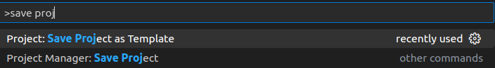
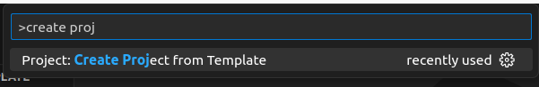

# Python project template
Create python project template using VSCode [project template](https://marketplace.visualstudio.com/items?itemName=cantonios.project-templates) extension

## usage
- Install `project template` extension
- Clone Repository
- Create template from clone project
- Make your on

### Install ext.
```bash
code --install-extension cantonios.project-templates	
```

### Clone

```bash
git clone git@github.com:robobe/python_project_template.git
```

### Create template from clone project




### Make your on



!!! Tip
    Run **build venv** task or `venv.bash` script 

---

## Project Templates
### placeholder


- Replace any string in file
- Can be file and folder names

#### fix placeholder
```json title="~/.config/Code/User/settings.json"
"projectTemplates.usePlaceholders": true,
"projectTemplates.placeholders": {
    "author": "robobe",
    "author_email": "robobe2020@gmail.com"
}
```

---

## Wiki
Check [Wiki](https://github.com/robobe/python_project_template/wiki) for more
